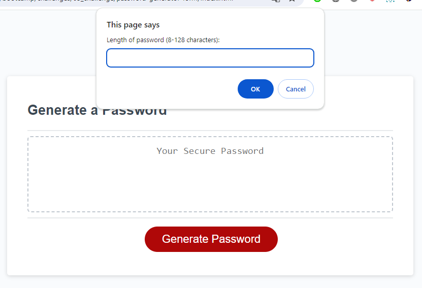
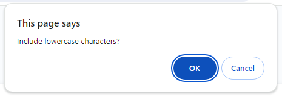
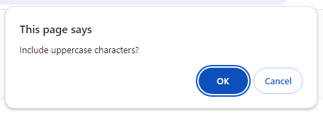
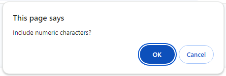
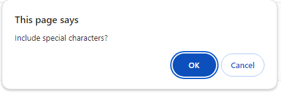
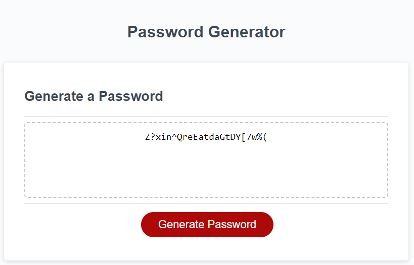

# Unit 4 Challenge: Password generator form

## Description

This program is a comprehensive solution for generating a custom password based on user-defined criteria. The user can choose the length and types of characters to include, and the script generates a random password accordingly.

The site can be accessed at https://oleksiieng.github.io/password-generator-form/

### This application might:

Generate a password when the button is clicked.

Present a series of prompts for password criteria:

Length of password: At least 8 characters but no more than 128.

Character types: Lowercase, Uppercase, Numeric, Special characters ($@%&*, etc.)

Code should validate for each input and at least one character type should be selected.

Once all prompts are answered, the password should be generated and displayed in an alert or written to the page.

## Table of Contents

- [Installation](#installation)
- [Credits](#credits)
- [License](#license)

## Installation

To install this project:

1. Clone the repository to your local machine using `git@github.com:Oleksiieng/password-generator-form.git`.
2. Open the project in VS Code or any preferred IDE.
3. Ensure you have a live server extension installed, or use a local server to view the web application.

## Credits

Resources consulted for learning purposes:

- [Mozilla Developer Network (MDN)](https://developer.mozilla.org/)
- [W3Schools](https://www.w3schools.com/)

## License

This site licensed under the [MIT license](https://opensource.org/licenses/MIT).
